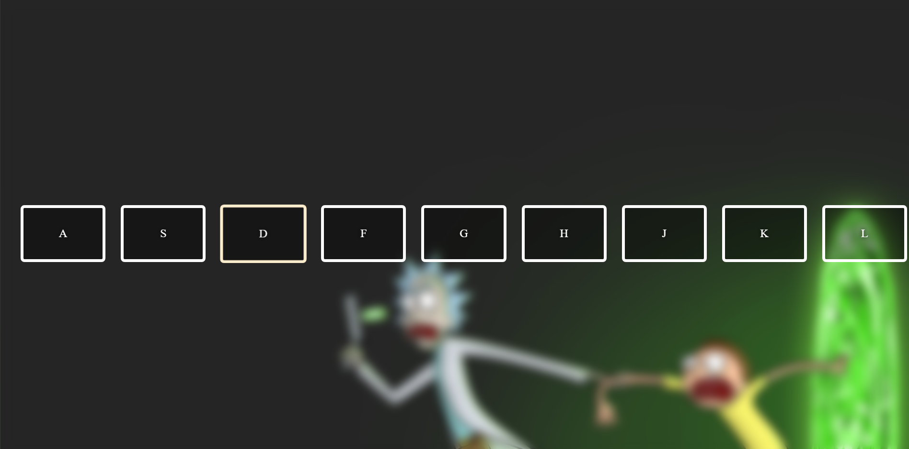

# drum-kit
This is a keyboard drum-kit built with HTML,CSS and JS. 
All the keys on the screen hava a sound associated with them. 
Pressing each key will produce a sound along with some change in scale and colour of the key.

